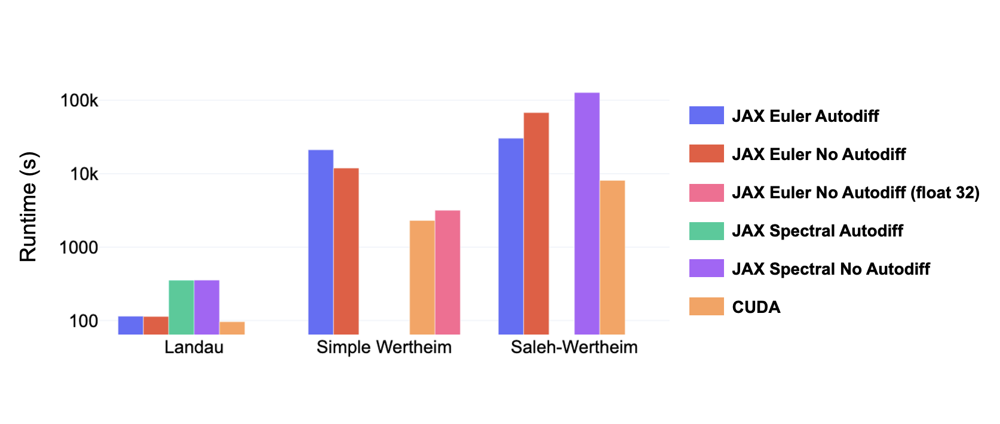

# Phase Field Modelling using JAX

Python / JAX implementation of Cahn-Hilliard and Allen-Cahn phase field model algorithms (inspired from https://github.com/lorenzo-rovigatti/cahn-hilliard) alongside [reproduced results](#performance-comparison). The output of this phase field package (i.e., the resultant mass / energy log and order parameter trajectory) are formatted similarly to the cahn-hilliard package, and here I also implemented the Allen-Cahn model. Furthermore, this package enables **automatic differentiation** to be leveraged for ML-based development of new free energy models (or the rapid prototyping of free energy models without having to touch CUDA code). Overall, if you are unfamiliar with phase fields / other mesoscopic simulations, I'd recommend reading Ch 12 and 13 of Introduction to Computational Materials Science by Richard Lesar.

Overall, this library has a focus on grid-based phase field modelling for self-assembly based systems, whereas other phase field model implementations (e.g., such as [JAX-AM](https://github.com/tianjuxue/jax-am)) focus on looking at grain development for additive manufacturing where the mesh quality is of greater importance. 

Finally, these are lengthy simulations if you do not have a hardware accelerator (i.e., GPU / TPU). This jax-based version can still run on a CPU and allow you to still simulate more simple energy functionals (i.e., Landau). Generally, the performance of the JAX-based implementation on CPU is comparable to the CPU-based C++ implementation. The JAX-based implementation on a hardware accelerator is much more performant than CPU, but less performant than a CUDA-based implementation. JAX is accessible on any type of computer (Windows, Mac, Linux) but Linux is preferred for easiest access to hardware acceleration.  For more information, see [here (https://docs.jax.dev/en/latest/).

# Implementation Details

- The code here supports 1D and 2D simulations and take a TOML-file based input detailing the simulation parameters [see input options](#descriptions-of-input-toml-options).
- Phase field models implemented: `Cahn-Hilliard` | `Allen-Cahn` |
- Free energy models implemented: `Landau` | `1-species Wertheim` | `Saleh-Wertheim` | `Generic Multi-species Wertheim`
  - Note: Generic Wertheim does NOT support autodiff as of now.
- Numerical Integrators implemented: `Explicit Euler` | `Semi-Implicit Fourier Spectral` 
- Only **periodic** boundary conditions are handled in this implementation.
- Currently, all grids are handled with constant size $N$ and grid-cell size of $dx$
- Free energies are handled as _dimensionless_, and the equation constants (e.g., M / mobility constant in Cahn-Hilliard) is actually $M'=K_bTM$ which is treated as 1 (nm s $)^{-1}$
- The input files in the Examples directory will show how scaling constants (for the interface / bulk energy values in the Allen-Cahn or Cahn-Hilliard) can be incorporated through the input config TOML to better fit this package to your specific needs

# Tips

- Be careful with how the density field is handled (i.e., it's shape is one of: (Ns, Nx), (Ns, Nx, Ny) or (Ns, Nx, Ny, Nz) where Ns is the number of species in the simulation)!
- The [MagneticFilm.py](https://github.com/ajvetturini/phase-field-models/blob/main/Examples/MagneticFilm/run.py) example shows how you can incorporate your own energy model to be solved via Allen-Cahn or Cahn-Hilliard as well as specifying unique initialization conditions outside of the default method using the `initial_density` config parameter.
- If your system has multiple GPUs, you can run the following command in terminal to specify a device: `CUDA_VISIBLE_DEVICES="DEVICE_NUMBER" python run.py` where the run.py script will read in a TOML and start a run (see [this example](https://github.com/ajvetturini/phase-field-models/blob/main/Examples/Landau/run.py))
- When developing your own energy model, start with float32 precision for ease-of-development. Increasing this to float64 is necessary for more complex free energy models (e.g., any of the Wertheim models), whereas float32 will still work for simple energy functionals like the Landau.
  - Float64 will greatly reduce the efficiency of the model (and is also dependent on GPU hardware)
  - The LaPlacian operator is the computational overhead since it is calculated twice during Cahn-Hilliard updates
  - Other jax-based implementations for handling the periodic boundary condition laplacian (e.g., FFT or Convolutions) did not seem to improve performance, but that may be due to my specific implementation!

# External Citations and Links

To learn more about the free energy models implemented in this package, please see the citations below. Also, if you used this package then let me know and I can add a citation here!

1. `Wertheim Theory` | Cappa, M., Sciortino, F., and Rovigatti, L., "A phase-field model for solutions of DNA-made particles", J. Chem. Phys. 162, 194901 (2025). | <a href="https://pubs.aip.org/aip/jcp/article/162/19/194901/3346915" target="_blank">LINK</a>
2. `Saleh Model` | Jeon, B. Nguyen, D. T., and Saleh, A. O., "Sequence-controlled adhesion and microemulsification in a two-phase system of DNA liquid droplets", Journal of Physical Chemistry 123 (2020). | <a href="https://pubs.acs.org/doi/10.1021/acs.jpcb.0c06911" target="_blank">LINK</a>

# Performance Comparison

<div align="center">
  
  <p><em>A runtime comparison between a variety of free energy functionals (Landau, Simple Wertheim, and Saleh-Wertheim). Note the log-scale on the Y-axis showing that CUDA is **much** faster, but harder to prototype in. Furthermore, this implementation offers differentiation thru the simulation! </em></p>
</div>

All simulations were run on an NVIDIA RTX A6000 GPU for performance benchmarking. The same initial condition was used in the respective simulations using the "load_from" functionality in the input TOML (with the exception of the Saleh-Wertheim system as the load_from command was not built into cahn-hilliard package when I test bedded this).

The spectral / semi-implicit method is quite slow compared to a simple explicit euler, even in the simple Landau free energy model. This behaviour was also noticed in [Cappa et al.](https://pubs.aip.org/aip/jcp/article/162/19/194901/3346915) and thus future work should consider novel numerical method integrators that allow for a combination of longer time steps to be taken during the simulation at a reasonable computational expense. Furthermore, coupling these systems (i.e., Cahn-Hilliard and Allen-Cahn) may be needed when looking at more complex self-assembling systems.

I am currently **debugging** the Simple Wertheim model to see why JAX does not seem to minimize the functional similarly to the CUDA implementation. This might be a simple bug or something much more complicated related to numerical stability / precision from JAX roll functions (i.e., periodic BCs). With that stated, the animations appear to be quite similar between the two, so I am leaning towards me having an implementation bug.

Finally, float32 precision in this JAX-based simulator is not enough for simple / saleh wertheim models (as shown in the trajectory animations below). The simulation minimizes the free energy until the (lack of) floating precision prevents further minimization, thus "stalling out" the simulation. This is scene by comparing the JAX-float32 trajectory (second row, third column) and comparing it to the JAX-float64 / CUDA implementations (second row, first and second columns).


# Descriptions of input TOML Options

**Simulation Options**
- `steps` (integer) : Number of integration steps to use in simulation
- `print_every` (integer) : Frequency to output the energy of the system
- `print_trajectory_every` (integer) : Frequency to output the per-species densities to a trajectory file for animations
- `seed` (integer) : Random seed for reproducibility
- `free_energy` (str) : The free energy model to use (see [Implementation Details](#implementation-details))
- `integrator` (str, default=`euler`) : Which time integration scheme to use (see [Implementation Details](#implementation-details))
- `model` (str, default = `ch`) : Which phase field model to use (either `ch` (Cahn-Hilliard) or `ac` (Allen-Cahn))
- `N` (int, default = `64`) : Linear size of the grid-based system. Note that the grids are constant (dx = dy) in this simulator.
- `k` (float, default = `1.0`) : Coefficient linked to free energy penalty at the interface of two phases
- `interface_scalar` (float, default = `1.0`) : A secondary coefficient linked to free energy penalty at interface. This can be modified based on your preferred derivation of Cahn-Hilliard (for example, in Saleh-Wertheim simulations, this should be set to 2.0)
- `M` (float, default = `1.0`) : Mobility coefficient for use in Cahn-Hilliard
- `L_phi` (float, default = `1.0`) : Kinetic coefficient for use in Allen-Cahn
- `dt` (float, default = `0.001`) : Integration time step
- `dx` (int, default = `1`) : Linear size of bins (nanometers)
- `dim` (int, default = `2`) : Dimensionality of system (either 1 or 2)
- `distance_scaling_factor` (int, default=`1`) : Numerical factor to internall rescale lengths (may increase stability)
- `write_path` (str) : Where to write output files to (defaults to run path)
- `pfm_diff_method` (str, default = `fwd`) : Forward or Central differences to use in spatial evolution (valid options are fwd or central)

**Initial Condition Options**
- `load_from` (str) : Filepath to initial configuration to use
- `initial_density` (float) : If not using load_from, you must specify an initial density for initial condition
  - `initial_A` (float, default = `0.001`) : Amplitude of sinusoidal modulation used in default initial condition densities
  - `initial_N_peaks` (int, default = `0`) : Number of oscillations across domain

**JAX-based Options**

Note: You must use the pfm.main.run() function to properly use these, as the sequence of imports matters.
- `float_type` (str, default = `float32`) : Floating precision to use (either float32 or float64)
- `use_autodiff` (bool, default = `False`) : Use automatic differentiation for the bulk free energy term during time integration
- `XLA_PYTHON_CLIENT_MEM_FRACTION` (float) : Limit the amount of GPU memory that JAX pre-allocates 
- `CUDA_VISIBLE_DEVICES` (int) : GPU Device ID that JAX will use 

# Package Requirements

This project requires Python 3.12. Due to the rapid development of JAX, it is strongly recommended to install dependencies in a clean Python 3.12 virtual environment. The following instructions assume you are using `conda`.

1. Create and activate a new environment

```
conda create -n [env_name] python=3.12
conda activate [env_name]
```

2. Clone the repository

```
git clone https://github.com/ajvetturini/phase-field-models
cd phase-field-models
```

3. Install the package in editable mode

```
pip install -e .
```

4. Install required dependencies (this is usually done automatically during step 3, but if you want to install JAX for GPU, then follow the first line below)

```
# For CUDA-enabled systems:
pip install "jax[cuda]" matplotlib toml tqdm

# For CPU-only or non-Linux systems (e.g., Windows/Mac):
pip install jax matplotlib toml tqdm
```

# Got questions?

Feel free to reach out to me at avetturi [at] andrew [dot] cmu [dot] edu or open a PR
